# Deploy a full-stack application consisting of a frontend and a backend application within a Virtual Private Cloud (VPC) on Google Cloud Platform (GCP):
Deploying a full-stack application on Google Cloud Platform within a Virtual Private Cloud (VPC) involves several steps, from setting up the VPC and creating instances for the frontend and backend to configuring networking, security, and deployment. Below, I'll outline the general steps to achieve this. Keep in mind that the specifics might vary based on your application's technology stack and requirements.


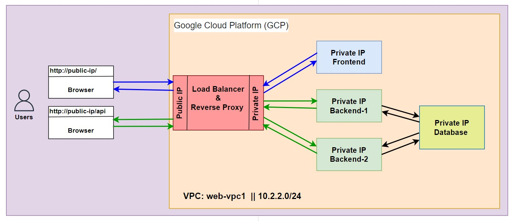


## Navigate to the Google Cloud Console:
Log in to your Google Cloud account and access the Google Cloud Console at https://console.cloud.google.com.


### Step-1: Creating VPC Network in GCP:

<details>
  <summary>Creating 'web-vpc1'</summary>


1. In the Cloud Console, click on the Navigation Menu (☰) in the top-left corner and select "**VPC network**" then click "**VPC networks**".

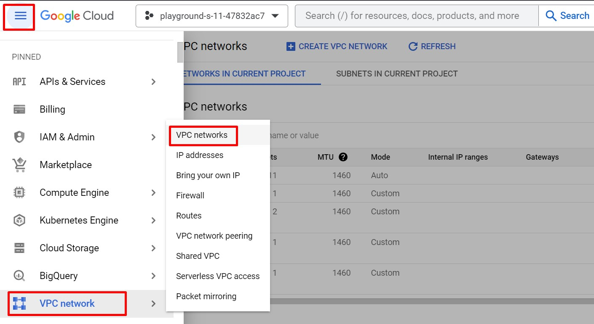


2. Click "**Create VPC network**".

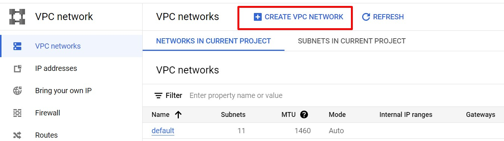


3. Enter a Name for the network and Choose Subnet creation mode either "Automatic" or "Custom." Automatic mode generates subnets with predefined IP ranges. Custom mode lets you specify your own IP ranges.
- **Name**: web-vpc1
- Select **Custom**

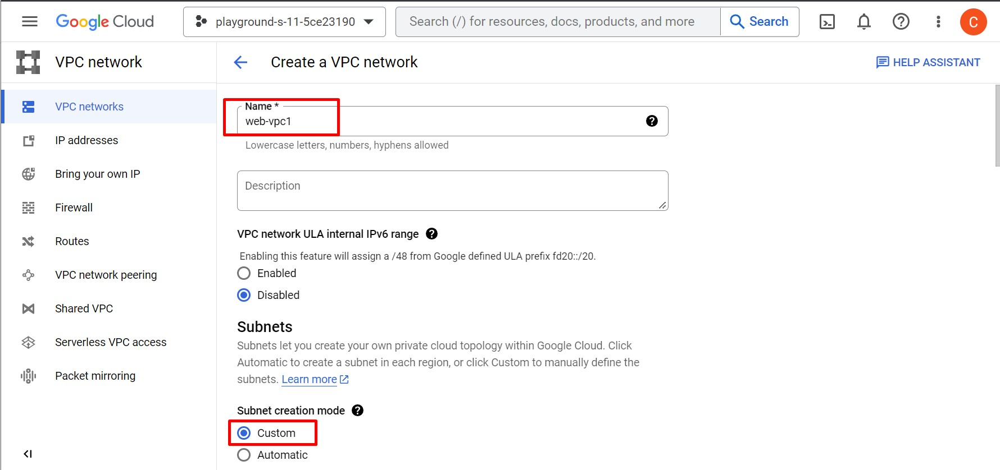


4. Configure a **New Subnet**:
- Subnet **Name**: subnet-web-vpc1
- Subnet **Region**: us-east1
- Select **IP stack type**: IPv4 (single stack)
- **IPv4 range**: 10.2.2.0/24 (Specify the CIDR range as per requirement)

- **Private Google Access**: Off (If you keep this option as ‘ON’ then it will allow this subnet to make API calls to GCP services privately)
- **Flow Logs**:  off
- To add more subnets, click "**ADD SUBNET**" and repeat the previous steps.

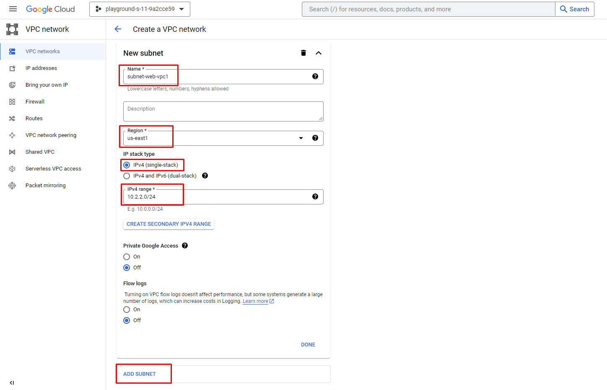


5. **Firewall Rules**: Allow Ingress ICMP, SSH and private subnet all  protocols/ports. If you don't select any predefined rules, you can create your own firewall rules after you create the network.

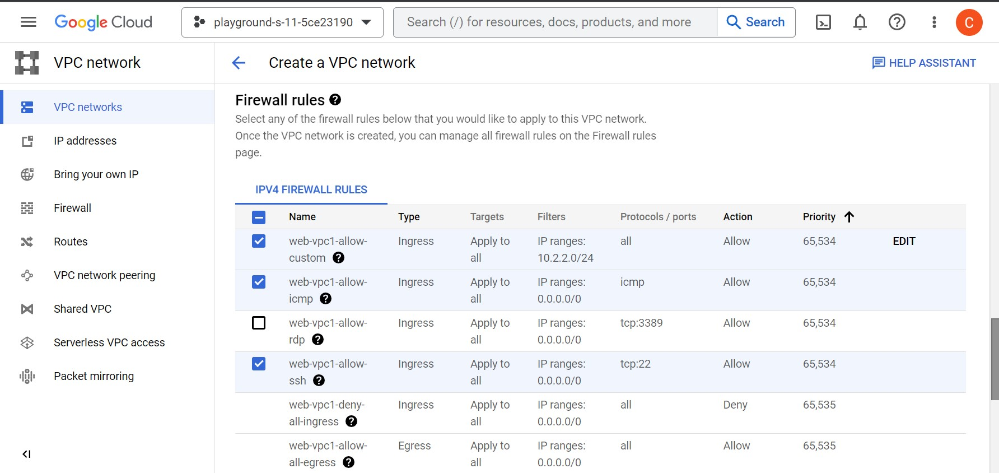


6. In the last step, choose the MTU of 1460 (default) and then click on ‘**Create**’ to create VPC along with its subnet.
- **Dynamic Routing Mode**: Regional

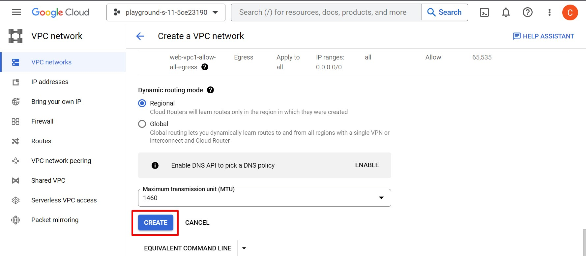


</details>


### Verify VPC Network and Subnet: 
After the VPC is created, we will get following on VPC networks.

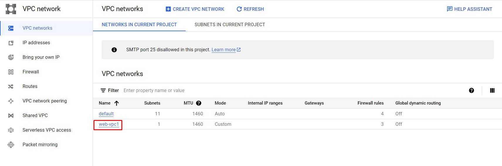


---
---


### Step-2: Creating VM in GCP:
Creating a Virtual Machine (VM) in Google Cloud Platform (GCP) involves several steps. Log in to your Google Cloud Console at "https://console.cloud.google.com/" using your GCP account credentials. Here's a step-by-step guide to help you create a VM:

<details>
  <summary>Creating VM 'frontend-server':</summary>

  1. In the Cloud Console, click on the Navigation Menu (☰) in the top-left corner and select "**Compute Engine**" then click "**VM instances**".


  2. Click "**Create instance**":

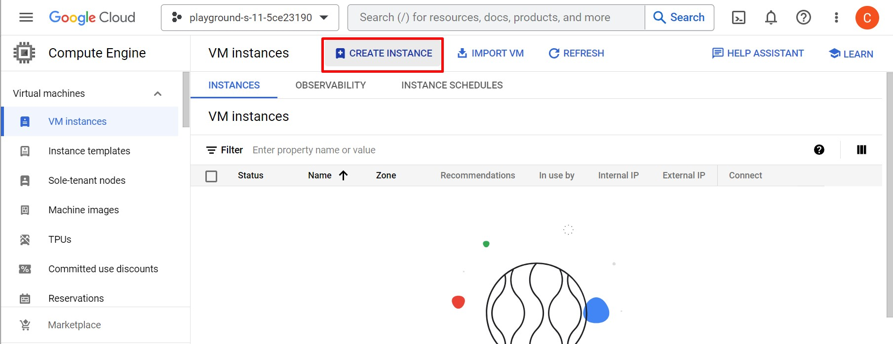

  3. Configure Instance Details:
  - **Name**: frontend-server (Provide a name for your VM)
  - **Region**: us-east1 (Choose the region)
  - **Zone**: us-east1-b (Availability zone for where you want to deploy your VM)

   - **Enter the following details under Machine configuration**:
   - Select the Machine family to '**General-purpose**'. 
   - Select the **Series**: E2 (select N2 or N1)
   - **Machine Type**: Select the desired machine type (CPU and memory configuration).
   - **VM provisioning model**: Standard


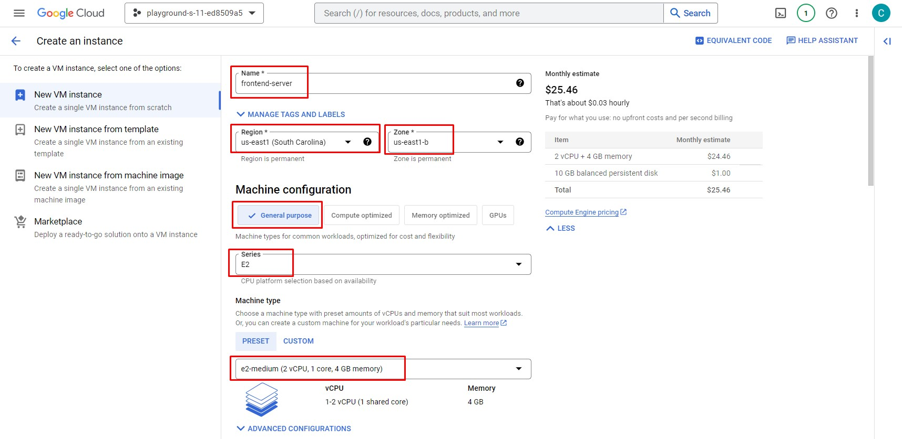


  4. In the Boot disk section, By default VM are created default image.
  
  - If Boot disk image  change to add the boot disk image, click '**Change**' under Boot disk, on the Public images tab, choose the following:
    - **Operating system**: 
    - **version**: 
    - **Boot disk type**
    - Boot disk **Size (GB)**: 
  - Optional: For advanced configuration options, click Show advanced configuration.
  - To confirm your boot disk options, click **Select**.


### Configure Identity and API Access:

Under the "Identity and API access" section, you can choose the service account and access scopes for your instance. You can also enable or disable various API access options.


 5. In the Firewall section, to permit HTTP or HTTPS traffic to the VM, select Allow HTTP traffic or Allow HTTPS traffic. You can allow both HTTP and HTTPS traffic or customize the firewall settings as needed.

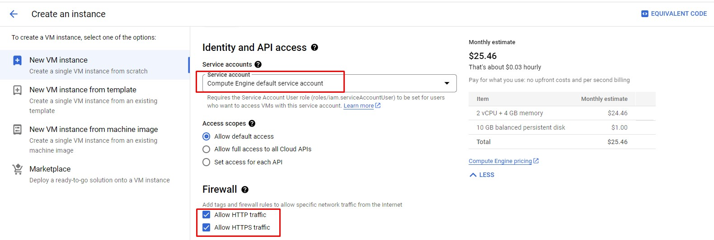


 6. Assign specific subnet for a VM, expand the '**Advanced options**' section.
   - Expand the '**Networking**' section and added Network interfaces click '**Add A Network Interface**': 

     - **Network**: web-vpc1
     - **Subnetwork**: subnet-web-vpc1

   - Select IP stack type:
     - **IPv4 (single-stck)**

   - Primary internal IPv4 address
     - **Ephemeral (Automatic)**

   - External IPv4 address
     - **Ephemeral**


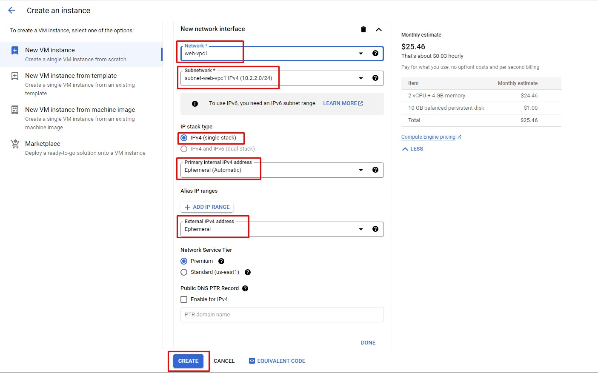


7. To Review and Create VM, click Create. Double-check all your settings on the review page. Once you're satisfied, click the "Create" button to start provisioning the VM.


</details>


<details>
  <summary>Creating VM 'backend-server1':</summary>

1. In the Cloud Console, click on the Navigation Menu (☰) in the top-left corner and select "**Compute Engine**" then click "**VM instances**".


  2. Click "**Create instance**":


  3. Configure Instance Details:
  - **Name**: backend1 (Provide a name for your VM)
  - **Region**: us-east1 (Choose the region)
  - **Zone**: us-east1-b (Availability zone for where you want to deploy your VM)

   - **Enter the following details under Machine configuration**:
   - Select the Machine family to '**General-purpose**'. 
   - Select the **Series**: E2 (select N2 or N1)
   - **Machine Type**: Select the desired machine type (CPU and memory configuration).
   - **VM provisioning model**: Standard

   - 
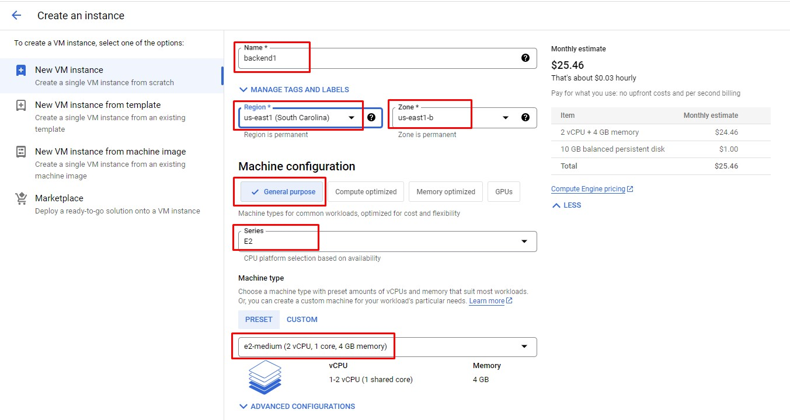


  4. In the Boot disk section, By default VM are created default image.
  
- If Boot disk image  change to add the boot disk image, click '**Change**' under Boot disk, on the Public images tab, choose the following:
    - **Operating system**: 
    - **version**: 
    - **Boot disk type**
    - Boot disk **Size (GB)**: 
  - Optional: For advanced configuration options, click Show advanced configuration.
  - To confirm your boot disk options, click **Select**.

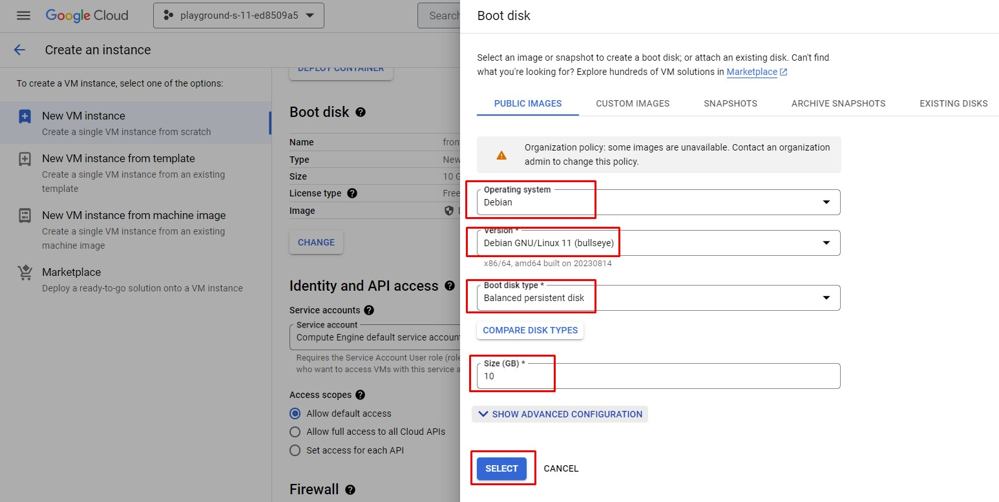


### Configure Identity and API Access:

Under the "Identity and API access" section, you can choose the service account and access scopes for your instance. You can also enable or disable various API access options.


 5. In the Firewall section, to permit HTTP or HTTPS traffic to the VM, select Allow HTTP traffic or Allow HTTPS traffic. You can allow both HTTP and HTTPS traffic or customize the firewall settings as needed.


 6. Assign specific subnet for a VM, expand the '**Advanced options**' section.
   - Expand the '**Networking**' section and added Network interfaces click '**Add A Network Interface**': 

     - **Network**: web-vpc1
     - **Subnetwork**: subnet-web-vpc1

   - Select IP stack type:
     - **IPv4 (single-stck)**

   - Primary internal IPv4 address
     - **Ephemeral (Automatic)**

   - External IPv4 address
     - **Ephemeral**

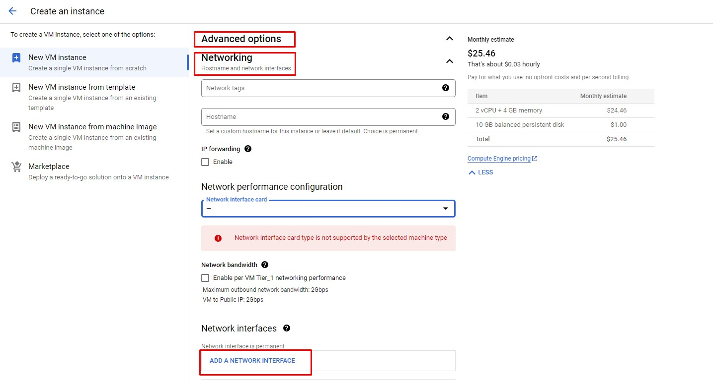


7. To Review and Create VM, click Create. Double-check all your settings on the review page. Once you're satisfied, click the "**Create**" button to start provisioning the VM.


</details>


<details>
  <summary>Creating VM 'backend-server2':</summary>


1. In the Cloud Console, click on the Navigation Menu (☰) in the top-left corner and select "**Compute Engine**" then click "**VM instances**".


  2. Click "**Create instance**":


  3. Configure Instance Details:
  - **Name**: backend2 (Provide a name for your VM)
  - **Region**: us-east1 (Choose the region)
  - **Zone**: us-east1-b (Availability zone for where you want to deploy your VM)

   - **Enter the following details under Machine configuration**:
   - Select the Machine family to '**General-purpose**'. 
   - Select the **Series**: E2 (select N2 or N1)
   - **Machine Type**: Select the desired machine type (CPU and memory configuration).
   - **VM provisioning model**: Standard

   - 
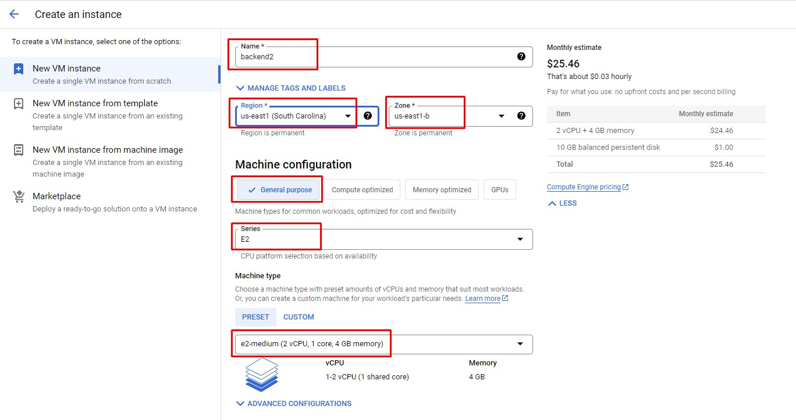


  4. In the Boot disk section, By default VM are created default image.
  
  - If Boot disk image  change to add the boot disk image, click '**Change**' under Boot disk, on the Public images tab, choose the following:
    - **Operating system**: 
    - **version**: 
    - **Boot disk type**
    - Boot disk **Size (GB)**: 
  - Optional: For advanced configuration options, click Show advanced configuration.
  - To confirm your boot disk options, click **Select**.


### Configure Identity and API Access:

Under the "Identity and API access" section, you can choose the service account and access scopes for your instance. You can also enable or disable various API access options.


 5. In the Firewall section, to permit HTTP or HTTPS traffic to the VM, select Allow HTTP traffic or Allow HTTPS traffic. You can allow both HTTP and HTTPS traffic or customize the firewall settings as needed.


 6. Assign specific subnet for a VM, expand the '**Advanced options**' section.
   - Expand the '**Networking**' section and added Network interfaces click '**Add A Network Interface**': 

     - **Network**: web-vpc1
     - **Subnetwork**: subnet-web-vpc1

   - Select IP stack type:
     - **IPv4 (single-stck)**

   - Primary internal IPv4 address
     - **Ephemeral (Automatic)**

   - External IPv4 address
     - **Ephemeral**


7. To Review and Create VM, click Create. Double-check all your settings on the review page. Once you're satisfied, click the "**Create**" button to start provisioning the VM.


</details>


### Verify VM Instance: 
After the VM is created, we will get following: 

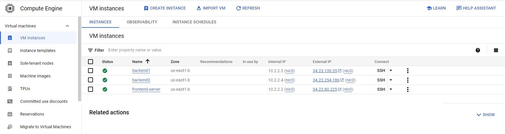


---
---


### Step-3: Configure Full-Stack Application:
#### Frontend:

- Choose a technology for your frontend (e.g., React, Angular, Vue.js).
- Develop your frontend application.

#### Backend:
- Choose a technology for your backend (e.g., Node.js, Python with Flask/Django, Java with Spring Boot).
- Develop your backend application.

<details>
  <summary>Configure Frontend-sever:</summary>

1. Install Node JS (For Debian):
```
curl -fsSL https://deb.nodesource.com/setup_18.x | bash - &&\
apt-get install -y nodejs

corepack enable

node -v
yarn -v

```

2. Create a New Project where project name is 'frontend_app', React framework and variant TypeScript + SWC:
```
yarn create vite
```

```
Output: 
yarn create v1.22.19

[1/4] Resolving packages...
[2/4] Fetching packages...
[3/4] Linking dependencies...
[4/4] Building fresh packages...

success Installed "create-vite@4.4.1" with binaries:
      - create-vite
      - cva
✔ Project name: frontend_app
✔ Select a framework: › React
✔ Select a variant: › TypeScript + SWC

Scaffolding project in /root/frontend_app...

Done. Now run:

  cd frontend_app
  yarn
  yarn dev

```

```
cd frontend_app

ls -l

-rw-r--r-- 1 root root 1263 Aug 31 07:09 README.md
-rw-r--r-- 1 root root  366 Aug 31 07:09 index.html
-rw-r--r-- 1 root root  750 Aug 31 07:09 package.json
drwxr-xr-x 2 root root 4096 Aug 31 07:09 public
drwxr-xr-x 3 root root 4096 Aug 31 07:09 src
-rw-r--r-- 1 root root  605 Aug 31 07:09 tsconfig.json
-rw-r--r-- 1 root root  213 Aug 31 07:09 tsconfig.node.json
-rw-r--r-- 1 root root  167 Aug 31 07:09 vite.config.ts

```

3. Installing all the dependencies of the project:
```
yarn install
```

```
Output:
yarn install v1.22.19

info No lockfile found.
[1/4] Resolving packages...
[2/4] Fetching packages...
[3/4] Linking dependencies...
[4/4] Building fresh packages...

success Saved lockfile.
```

4. Build the project: 
```
yarn run build 
```

```

Output: 
yarn run v1.22.19

$ tsc && vite build
vite v4.4.9 building for production...
✓ 34 modules transformed.
dist/index.html                   0.46 kB │ gzip:  0.30 kB
dist/assets/react-35ef61ed.svg    4.13 kB │ gzip:  2.14 kB
dist/assets/index-d526a0c5.css    1.42 kB │ gzip:  0.74 kB
dist/assets/index-c7e05d32.js   143.41 kB │ gzip: 46.10 kB
✓ built in 1.96s
```

```
5. Run the server:

yarn preview --host --port 8080

Output:
yarn run v1.22.19
$ vite preview --host --port 8080
  ➜  Local:   http://localhost:8080/
  ➜  Network: http://10.2.2.2:8080/
  ➜  press h to show help
```


</details>


<details>
  <summary>Configure Backend-sever1:</summary>

1. Install Node JS (For Debian):
```
curl -fsSL https://deb.nodesource.com/setup_18.x | bash - &&\
apt-get install -y nodejs

corepack enable

node -v
yarn -v

```

```
mkdir node_backend1
cd node_backend1

npm init -y 
yarn add express
```

2. Backend Server config file: 

```
vim index.js

const express = require('express');

//Create express app:
const app = express();
const port = 8090;

//Define a route:
app.get('/', (req, res) => {
    res.send('Backend-1...');
});

//Start the Express Server:
app.listen(port, () => {
    console.log('Server Running at Port:', port);
});

Save and exit the file.
```


3. Run the server:
```
node index.js
```


</details>


<details>
  <summary>Configure Backend-sever2:</summary>

1. Install Node JS (For Debian):
```
curl -fsSL https://deb.nodesource.com/setup_18.x | bash - &&\
apt-get install -y nodejs

corepack enable

node -v
yarn -v

```

```
mkdir node_backend1
cd node_backend1

npm init -y 
yarn add express
```

2. Backend Server config file: 

```
vim index.js

const express = require('express');

//Create express app:
const app = express();
const port = 8090;

//Define a route:
app.get('/', (req, res) => {
    res.send('Backend-2...');
});

//Start the Express Server:
app.listen(port, () => {
    console.log('Server Running at Port:', port);
});

Save and exit the file.
```


3. Run the server:

```
node index.js
```

</details>

### Verify Frontend and Backend Server: 

1. Frontend Server:

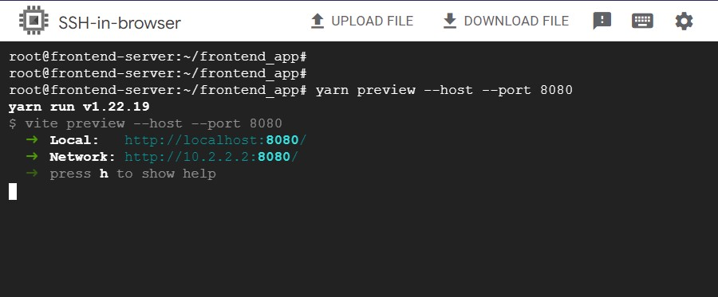


2. Backend Server-1:

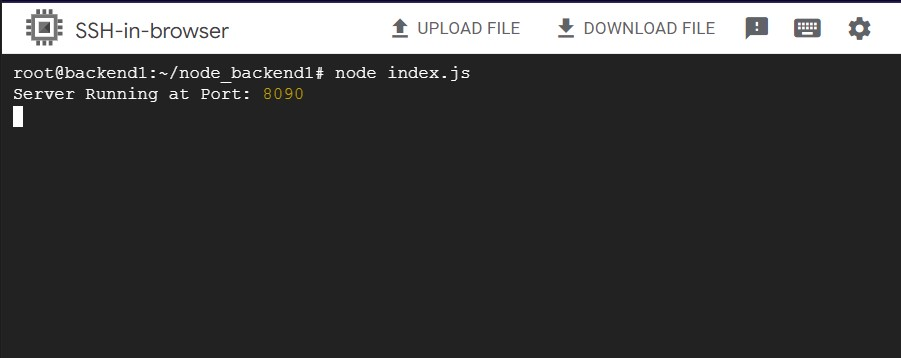


3. Backend Server-2:

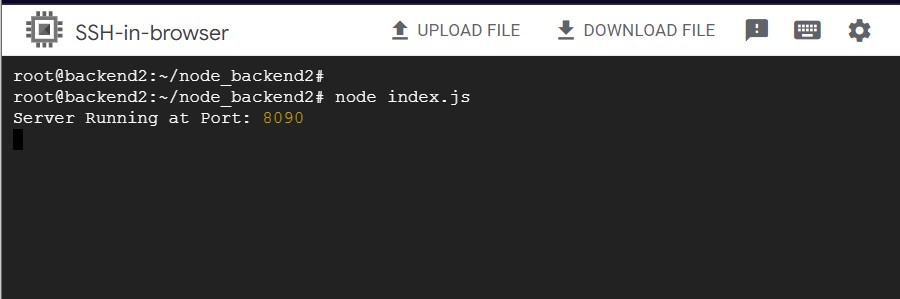

---
---

### Step-4: Configure Load Balancer:

<details>
  <summary>Creating VM 'load-balancer':</summary>


1. In the Cloud Console, click on the Navigation Menu (☰) in the top-left corner and select "**Compute Engine**" then click "**VM instances**".

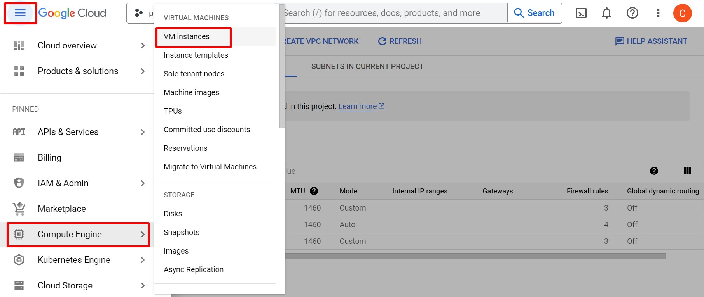

  2. Click "**Create instance**":


  3. Configure Instance Details:
  - **Name**: load-balancer (Provide a name for your VM)
  - **Region**: us-east1 (Choose the region)
  - **Zone**: us-east1-b (Availability zone for where you want to deploy your VM)

   - **Enter the following details under Machine configuration**:
   - Select the Machine family to '**General-purpose**'. 
   - Select the **Series**: E2 (select N2 or N1)
   - **Machine Type**: Select the desired machine type (CPU and memory configuration).
   - **VM provisioning model**: Standard

   - 
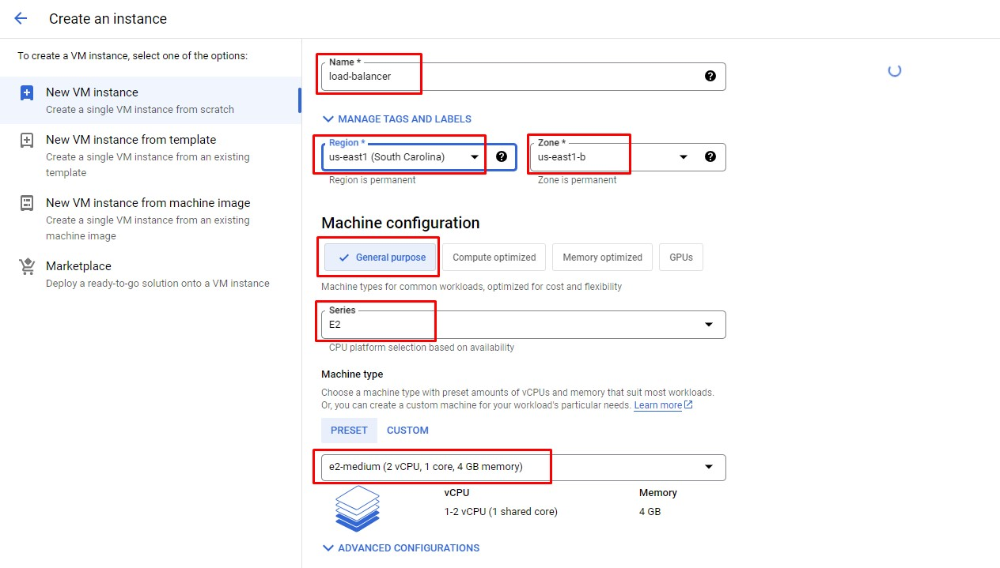


  4. In the Boot disk section, By default VM are created default image.
  
  - If Boot disk image  change to add the boot disk image, click 'Change' under Boot disk, on the Public images tab, choose the following:
    - **Operating system**: 
    - **version**: 
    - **Boot disk type**
    - Boot disk **Size (GB)**: 
  - Optional: For advanced configuration options, click Show advanced configuration.
  - To confirm your boot disk options, click "**Select**".


### Configure Identity and API Access:

Under the "Identity and API access" section, you can choose the service account and access scopes for your instance. You can also enable or disable various API access options.


 5. In the Firewall section, to permit HTTP or HTTPS traffic to the VM, select Allow HTTP traffic or Allow HTTPS traffic. You can allow both HTTP and HTTPS traffic or customize the firewall settings as needed.


 6. Assign specific subnet for a VM, expand the '**Advanced options**' section.
   - Expand the '**Networking**' section and added Network interfaces click '**Add A Network Interface**': 

     - **Network**: web-vpc1
     - **Subnetwork**: subnet-web-vpc1

   - Select IP stack type:
     - **IPv4 (single-stck)**

   - Primary internal IPv4 address
     - **Ephemeral (Automatic)**

   - External IPv4 address
     - **Ephemeral**


7. To Review and Create VM, click Create. Double-check all your settings on the review page. Once you're satisfied, click the "Create" button to start provisioning the VM.


</details>


### Verify All VM Instance: 
After the VM is created, we will get following: 

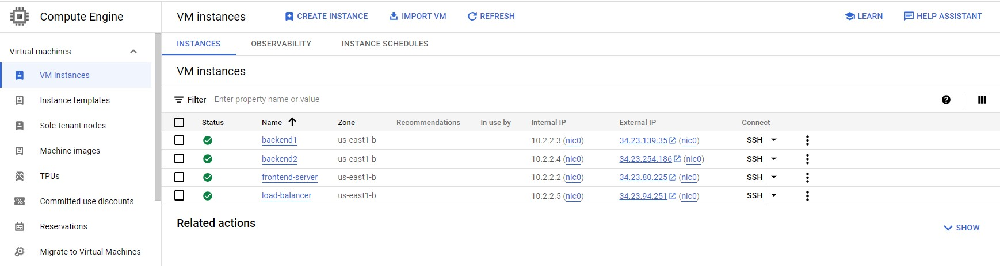

### Table 1- IP Summary: 

|SL   | Server Name | Internal IP   | External IP |
|---: |:---            | :---       | :--- |
| 1   | frontend       | 10.2.2.2   |    |
| 2   | backend-1      | 10.2.2.3   |    |
| 3   | backend-2      | 10.2.2.4   |    |
| 4   | load-balancer  | 10.2.2.5   | 34.23.94.251 |


---
---

### Step-5: Load Balancer Configure using NGINX:

1. Install required packages:
```
apt update -y
apt install telnet -y
apt install nginx -y

```

2. Nginx config file: 
```
vim /etc/nginx/nginx.conf

events {
#empty
}

http {

server {
        listen 80;

        location / {
            proxy_pass http://frontend;
        }
        
        location /api/ {
        rewrite ^/api/(.*)$ /$1 break;
        proxy_pass http://backend;
        }

    }

upstream frontend {
   server 10.2.2.2:8080; 
}

upstream backend {
        server 10.2.2.3:8090;
        server 10.2.2.4:8090;
    }

}

Save and exit
```

```
systemctl restart nginx
systemctl status nginx

```


---
---

### Testing:
- Check **telnet** service from load balancer: 

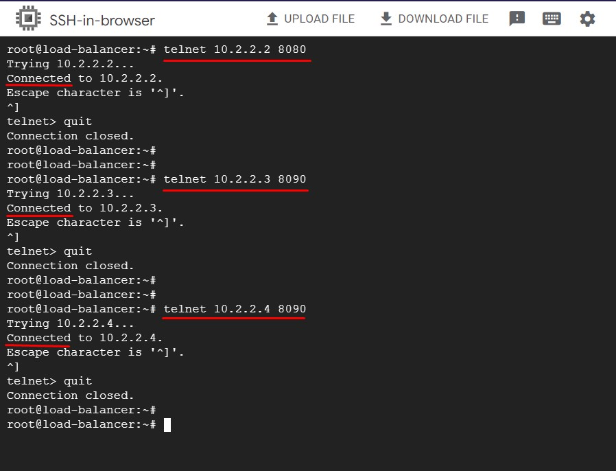


### Check Load Balancer, its should be working:
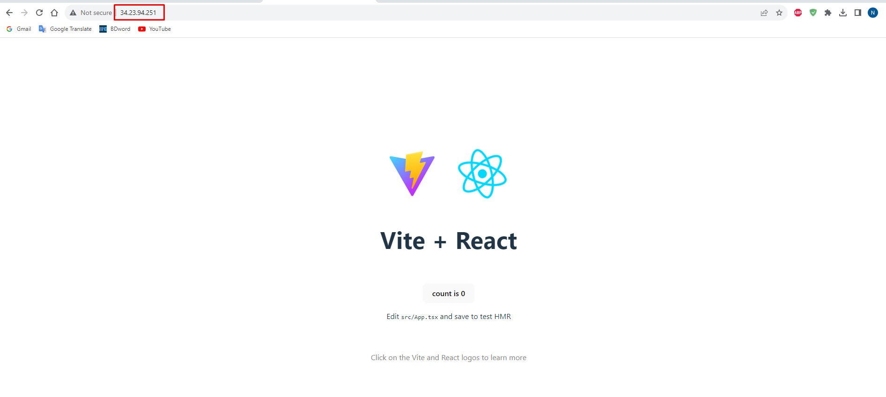
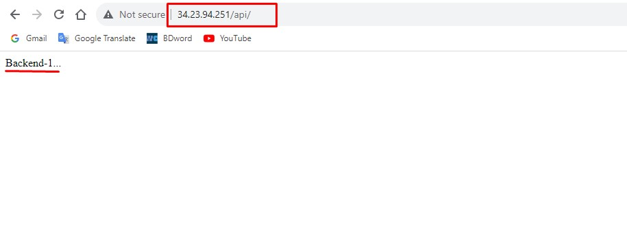 </br>
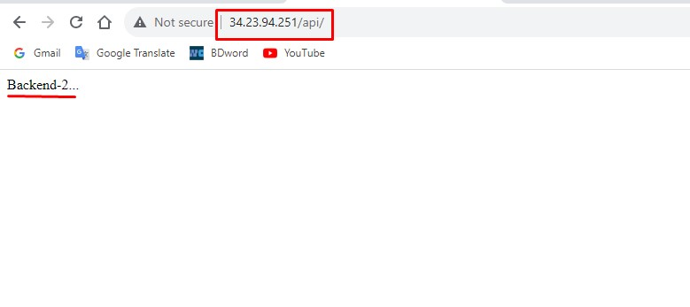

Keep in mind that for a complete full-stack application, you would also need to deploy your backend, set up networking and security, and possibly use additional services like databases, load balancers, and virtual machines. If you have a more complex application, feel free to provide more details so I can assist you accordingly.


